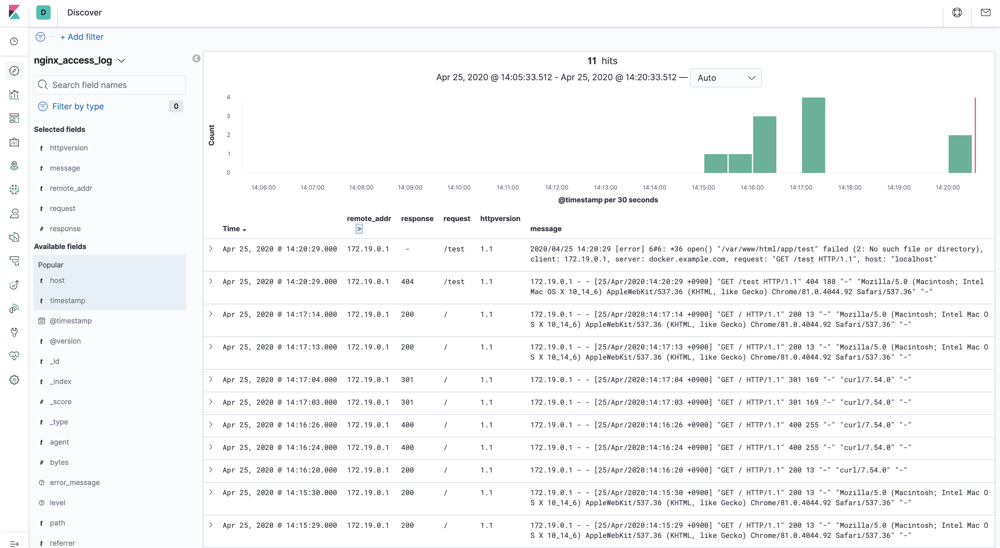
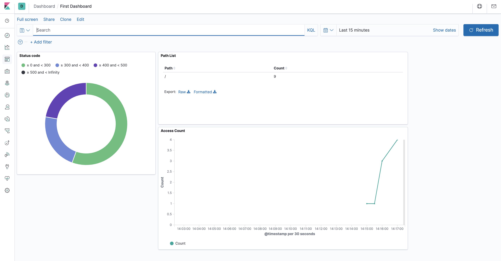

# What is elasticsearch-playbook-docker

## Abstract

elasticsearch-playbook-docker is playground environment for using elasticsearch, kibana and logstash.

This repository is useful if you want to learn how to use the elasticsearch environment.

## How to use

Usage is simple. It can be used with the following command.

### Requirements

| Middleware | Version |
| :---- | :---- |
| Docker | 19.03.5 |
| docker-composer | 1.24.1 |

### Getting Started

1. run playground environment

```bash
$ docker-compose up --build -d
```

2. access https://localhost
    - Using your favorite browser, curl command and so on.
    - After access localhost, access logs are stored in elasticsearch by logstash.

3. access http://localhost:5601
    - You can use kibana playground by accessing http://localhost:5601.
    - You can customize kibana as shown in the images below.
    - Kibana discover sample
      
    - Kibana dashboard sample
      

4. stop playground environment
```bash
$ docker-compose down
```

## Docker environments

The middleware versions are as follows.

| Service | Middleware | Version |
| :---- | :---- | :---- |
| web | Nginx | 1.17.9 |
| elasticsearch | Elasticsearch | 7.6.1 |
| kibana | Kibana | 7.6.1 |
| logstash | Logstash | 7.6.1 |
